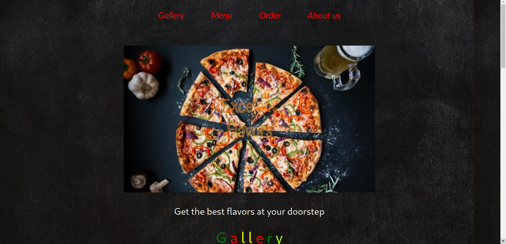

<h1>Pie Inn</h1>

We are a Pizza baking company establish in 1995.

<h2>Description</h2>

This is our customer website. It allows one to order a pizza of their choice and get it delivered at there door step or come and pick it at the nearest branch. 

<h2>Installation</h2>

To open this webpage you are required to  copy this link https://blackcaleb.github.io/pieInn/ into your browser.

<h2>Specifications</h2>

For this link to work the specifications are a browser application and also internet connection. This link doesnt require any special permissions to work.

<h2>Usage</h2>

To navigate through the website just scroll up and down.

<h2>Visuals</h2>

This is a screenshot of the webpage.

<h2>Contributing</h2>

In a case you have any issue with this project you can always pull a request at the pull request centre. In the near future we will be adding new content so keep in touch with us. This project is open to contributions. If one has any contributions you should state so in the pull request centre and we will reach to you.

We would like to acknowledge Moringaschool and also @JoshuaBarawa they contributed a lot in the complition of this project.

<h1>License</h1>

MIT License

Copyright (c)[2021][blackCaleb]